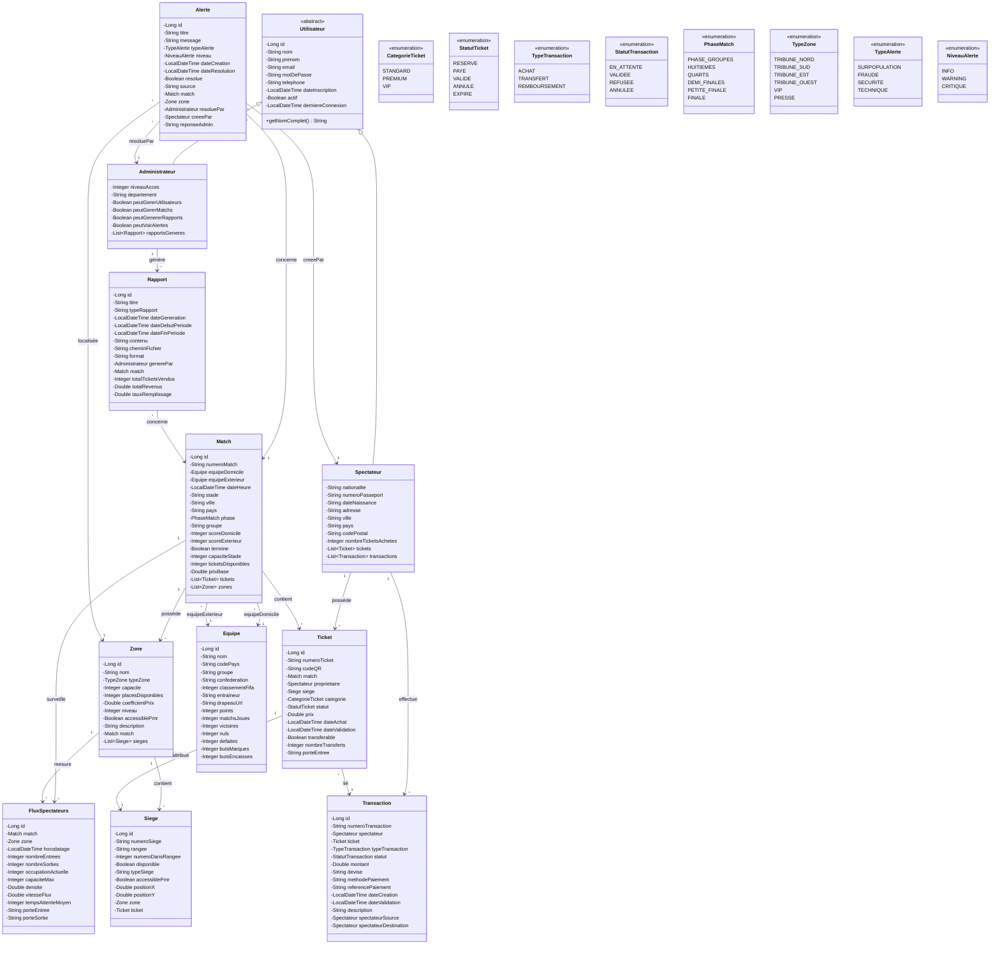

# 📋 Compte Rendu Structuré - Ticketing Mondial 2030

## Réaliser par : HAITAM SALAH-EDDINE
---
<br>

<br>

## 📑 Table des Matières

- [Présentation Générale](#-présentation-générale)
- [Architecture du Projet](#️-architecture-du-projet)
- [Patterns de Conception Utilisés](#-patterns-de-conception-utilisés)
- [Composants du Projet](#️-composants-du-projet)
  - [Couche Entity](#-couche-entity-21-classes)
  - [Couche DAO](#-couche-dao-14-interfaces--14-implémentations)
  - [Couche Service](#-couche-service-6-services)
  - [Couche Controller](#-couche-controller-4-contrôleurs)
  - [Utilitaires](#-utilitaires-3-classes)
- [Fonctionnalités](#-fonctionnalités)
- [Diagramme de Classes Simplifié](#-diagramme-de-classes-simplifié)
- [Flux de l'Application](#-flux-de-lapplication)
- [Statistiques du Projet](#-statistiques-du-projet)

---

## 🎯 Présentation Générale

| Élément | Détail |
|---------|--------|
| **Nom** | Plateforme Intelligente de Gestion des Tickets - Mondial 2030 |
| **Version** | 1.0-SNAPSHOT |
| **Type** | Application Desktop JavaFX |
| **Package** | `com.mondial2030` |
| **Objectif** | Gestion complète des tickets pour la Coupe du Monde 2030 |
| **Langage** | Java 17 |
| **Framework UI** | JavaFX 21.0.1 |
| **Base de données** | SQLite (embarquée) |
| **ORM** | Hibernate 6.4.1 |

---

## 🏗️ Architecture du Projet

L'application suit une **architecture en couches** (Layer Architecture) :

```
┌─────────────────────────────────────┐
│      Présentation (JavaFX/FXML)     │  ← Controllers + FXML + CSS
├─────────────────────────────────────┤
│         Services (Métier)           │  ← Logique métier
├─────────────────────────────────────┤
│      DAO (Data Access Object)       │  ← Interfaces + Implémentations
├─────────────────────────────────────┤
│         Entités JPA (Entity)        │  ← Modèle de données
├─────────────────────────────────────┤
│      Hibernate ORM + SQLite DB      │  ← Persistance
└─────────────────────────────────────┘
```

---

## 📦 Patterns de Conception Utilisés

| Pattern | Utilisation |
|---------|-------------|
| **DAO (Data Access Object)** | Séparation de la logique d'accès aux données |
| **Singleton** | Services métier avec instance unique |
| **MVC (Model-View-Controller)** | Architecture pour l'interface JavaFX |
| **Factory** | Création des sessions Hibernate via `HibernateUtil` |
| **Template Method** | Classe `BaseController` pour les contrôleurs |

---

## 🗂️ Composants du Projet

### 📌 Couche Entity (21 classes)

#### Classes Principales
| Fichier | Description |
|---------|-------------|
| `Utilisateur.java` | Classe parent abstraite (héritage) |
| `Administrateur.java` | Utilisateur avec rôle administrateur |
| `Spectateur.java` | Utilisateur avec rôle spectateur |
| `Match.java` | Représente un match de football |
| `Equipe.java` | Équipe nationale participante |
| `Ticket.java` | Ticket acheté par un spectateur |
| `Zone.java` | Zone du stade (VIP, Tribune, etc.) |
| `Siege.java` | Siège individuel dans une zone |
| `Transaction.java` | Historique des transactions financières |
| `Alerte.java` | Alertes système (surpopulation, fraude) |
| `Rapport.java` | Rapports générés par les administrateurs |
| `FluxSpectateurs.java` | Données de flux en temps réel |
| `OptimisateurFlux.java` | Optimisation des flux de spectateurs |

#### Énumérations
| Fichier | Valeurs |
|---------|---------|
| `CategorieTicket.java` | Catégories de prix des tickets |
| `PhaseMatch.java` | Phases de la compétition |
| `NiveauAlerte.java` | Niveaux de gravité des alertes |
| `StatutTicket.java` | États possibles d'un ticket |
| `StatutTransaction.java` | États des transactions |
| `TypeAlerte.java` | Types d'alertes système |
| `TypeTransaction.java` | Types de transactions (achat, transfert, etc.) |
| `TypeZone.java` | Types de zones dans le stade |

---

### 📌 Couche DAO (14 interfaces + 14 implémentations)

| Interface | Implémentation | Description |
|-----------|----------------|-------------|
| `GenericDAO<T>` | `GenericDAOImpl<T>` | DAO générique avec CRUD |
| `UtilisateurDAO` | - | Hérite de GenericDAO |
| `AdministrateurDAO` | `AdministrateurDAOImpl` | Gestion des admins |
| `SpectateurDAO` | `SpectateurDAOImpl` | Gestion des spectateurs |
| `MatchDAO` | `MatchDAOImpl` | Gestion des matchs |
| `EquipeDAO` | `EquipeDAOImpl` | Gestion des équipes |
| `TicketDAO` | `TicketDAOImpl` | Gestion des tickets |
| `ZoneDAO` | `ZoneDAOImpl` | Gestion des zones |
| `SiegeDAO` | `SiegeDAOImpl` | Gestion des sièges |
| `TransactionDAO` | `TransactionDAOImpl` | Gestion des transactions |
| `AlerteDAO` | `AlerteDAOImpl` | Gestion des alertes |
| `RapportDAO` | `RapportDAOImpl` | Gestion des rapports |
| `FluxSpectateurDAO` | `FluxSpectateurDAOImpl` | Gestion des flux |
| `OptimisateurFluxDAO` | `OptimisateurFluxDAOImpl` | Optimisation flux |

---

### 📌 Couche Service (6 services)

| Service | Fonctionnalités |
|---------|-----------------|
| `AuthenticationService` | Inscription, connexion, validation mot de passe, hachage BCrypt |
| `TicketService` | Achat, transfert, annulation, remboursement de tickets |
| `MatchService` | CRUD des matchs, gestion des équipes participantes |
| `AlerteService` | Création, notification et gestion des alertes en temps réel |
| `RapportService` | Génération de rapports, export PDF via iText |
| `FluxService` | Suivi et optimisation des flux de spectateurs |

---

### 📌 Couche Controller (4 contrôleurs)

| Contrôleur | Vue FXML | Description |
|------------|----------|-------------|
| `BaseController` | - | Classe abstraite de base avec méthodes communes |
| `LoginController` | `Login.fxml` | Gestion connexion/inscription |
| `AdminDashboardController` | `AdminDashboard.fxml` | Dashboard administrateur complet |
| `SpectateurDashboardController` | `SpectateurDashboard.fxml` | Espace spectateur |

---

### 📌 Utilitaires (3 classes)

| Utilitaire | Fonction |
|------------|----------|
| `HibernateUtil` | Singleton Factory pour SessionFactory Hibernate |
| `DataInitializer` | Initialisation des données de démonstration au démarrage |
| `QRCodeGenerator` | Génération de QR codes uniques pour les tickets (ZXing) |

---

## ✨ Fonctionnalités

### 👤 Pour les Spectateurs
| Fonctionnalité | Description |
|----------------|-------------|
| 🔐 Authentification | Inscription et connexion sécurisée (BCrypt) |
| ⚽ Matchs | Consultation des matchs disponibles |
| 🎫 Achat | Achat de tickets avec choix de zone et catégorie |
| 📤 Transfert | Transfert de tickets à d'autres spectateurs |
| ❌ Annulation | Annulation et remboursement de tickets |
| 📱 QR Code | QR code unique pour chaque ticket |
| 📊 Historique | Historique complet des transactions |

### 👨‍💼 Pour les Administrateurs
| Fonctionnalité | Description |
|----------------|-------------|
| 📊 Dashboard | Statistiques en temps réel avec graphiques |
| ⚽ Matchs | Gestion complète des matchs (CRUD) |
| 👥 Utilisateurs | Gestion des comptes spectateurs |
| 🎫 Tickets | Suivi de toutes les ventes |
| 🔔 Alertes | Système d'alertes (surpopulation, fraudes) |
| 📈 Rapports | Génération et export de rapports PDF |
| 🚶 Flux | Visualisation et optimisation des flux |

---

## 📊 Diagramme de Classes Simplifié



---

## 🔄 Flux de l'Application

```
┌─────────────┐     ┌─────────────┐     ┌─────────────┐
│   MainApp   │────▶│    Login    │────▶│  Dashboard  │
│  (init DB)  │     │  Controller │     │  (Admin ou  │
└─────────────┘     └─────────────┘     │  Spectateur)│
                                        └─────────────┘
```

1. **Démarrage** : `MainApp.init()` initialise Hibernate et les données de démo
2. **Connexion** : `LoginController` gère l'authentification
3. **Navigation** : Redirection vers le dashboard approprié selon le rôle

---

## 📈 Statistiques du Projet

| Métrique | Valeur |
|----------|--------|
| Nombre de classes Java | ~45 |
| Nombre d'entités JPA | 21 |
| Nombre de services | 6 |
| Nombre de contrôleurs | 4 |
| Nombre de vues FXML | 3 |
| Lignes CSS | ~1200 |
| Dépendances Maven | 13 |

---

*Document généré le 11 janvier 2026*
