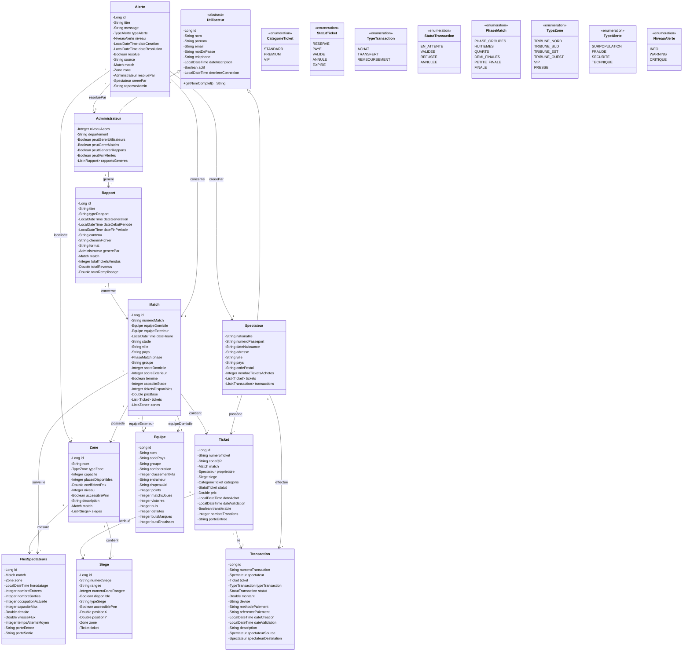

# 📊 Rapport d'Analyse du Projet : Mondial 2030 Ticketing Platform

> **Date d'analyse** : 11 Janvier 2026  
> **Projet** : Plateforme Intelligente de Gestion des Tickets - Mondial 2030  
> **Chemin** : `E:\javaprojet\ticketing-mondial-2030`

---

## 📋 Table des Matières

1. [Vue d'ensemble](#1-vue-densemble)
2. [Architecture Technique](#2-architecture-technique)
3. [Design Patterns Utilisés](#3-design-patterns-utilisés)
4. [Modèle de Données](#4-modèle-de-données)
5. [Fonctionnalités Implémentées](#5-fonctionnalités-implémentées)
6. [Interfaces Utilisateur](#6-interfaces-utilisateur)
7. [Sécurité](#7-sécurité)
8. [Services Métier](#8-services-métier)
9. [Points Forts](#9-points-forts)
10. [Points d'Amélioration](#10-points-damélioration)
11. [Guide de Lancement](#11-guide-de-lancement)
12. [Conclusion](#12-conclusion)

---

## 1. Vue d'ensemble

| Aspect | Détail |
|--------|--------|
| **Nom** | Plateforme Intelligente de Gestion des Tickets - Mondial 2030 |
| **Type** | Application Desktop JavaFX |
| **Domaine** | Billetterie pour la Coupe du Monde 2030 |
| **Architecture** | MVC en couches (Layer Architecture) |
| **Build Tool** | Maven |
| **Version Java** | 17 |

### Description

Cette plateforme permet la gestion complète des tickets pour la Coupe du Monde 2030, incluant :
- Gestion des matchs et des équipes
- Vente et transfert de tickets
- Suivi des flux de spectateurs
- Génération de rapports
- Système d'alertes en temps réel

---

## 2. Architecture Technique

### 2.1 Stack Technologique

| Technologie | Version | Usage |
|-------------|---------|-------|
| **Java** | 17 | Langage principal |
| **JavaFX** | 21.0.1 | Interface graphique |
| **Hibernate** | 6.4.1.Final | ORM (Object-Relational Mapping) |
| **SQLite** | 3.44.1.0 | Base de données embarquée |
| **BCrypt** | 0.4 | Hachage des mots de passe |
| **ZXing** | 3.5.2 | Génération de QR codes |
| **iText** | 8.0.2 | Génération de PDF |
| **SLF4J** | 2.0.9 | Logging |
| **CSSFX** | 11.5.1 | Rechargement CSS temps réel |

### 2.2 Diagramme d'Architecture en Couches

```
┌─────────────────────────────────────────────────────────────┐
│              PRÉSENTATION (JavaFX)                          │
│         Controllers + FXML + CSS                            │
│   LoginController, AdminDashboardController,                │
│   SpectateurDashboardController                             │
├─────────────────────────────────────────────────────────────┤
│              SERVICES (Logique Métier)                      │
│   AuthenticationService, TicketService, MatchService,       │
│   AlerteService, RapportService, FluxService                │
├─────────────────────────────────────────────────────────────┤
│              DAO (Data Access Object)                       │
│         Interfaces + Implémentations                        │
│   GenericDAO<T,ID> → GenericDAOImpl<T,ID>                   │
│   14 interfaces + 14 implémentations spécialisées           │
├─────────────────────────────────────────────────────────────┤
│              ENTITÉS JPA (Entity)                           │
│   Utilisateur, Ticket, Match, Equipe, Zone, Siege,          │
│   Transaction, Alerte, Rapport, FluxSpectateurs...          │
│   (21 classes d'entités)                                    │
├─────────────────────────────────────────────────────────────┤
│              HIBERNATE ORM + SQLite DB                      │
│   hibernate.cfg.xml → mondial2030.db                        │
└─────────────────────────────────────────────────────────────┘
```

### 2.3 Organisation des Packages

```
com.mondial2030/
├── MainApp.java                    # Point d'entrée JavaFX
├── controller/                     # Contrôleurs JavaFX (MVC)
│   ├── BaseController.java
│   ├── LoginController.java
│   ├── AdminDashboardController.java
│   └── SpectateurDashboardController.java
├── dao/
│   ├── interfaces/                 # 14 interfaces DAO
│   │   ├── GenericDAO.java
│   │   ├── TicketDAO.java
│   │   ├── MatchDAO.java
│   │   └── ...
│   └── impl/                       # Implémentations DAO
│       ├── GenericDAOImpl.java
│       ├── TicketDAOImpl.java
│       ├── MatchDAOImpl.java
│       └── ...
├── entity/                         # 21 Entités JPA
│   ├── Utilisateur.java (abstract)
│   ├── Administrateur.java
│   ├── Spectateur.java
│   ├── Match.java
│   ├── Ticket.java
│   └── ...
├── service/                        # 6 Services métier
│   ├── AuthenticationService.java
│   ├── TicketService.java
│   ├── MatchService.java
│   ├── AlerteService.java
│   ├── RapportService.java
│   └── FluxService.java
└── util/                           # Utilitaires
    ├── HibernateUtil.java
    ├── DataInitializer.java
    └── QRCodeGenerator.java
```

### 2.4 Configuration Hibernate

```xml
<!-- hibernate.cfg.xml -->
<property name="hibernate.connection.driver_class">org.sqlite.JDBC</property>
<property name="hibernate.connection.url">jdbc:sqlite:mondial2030.db</property>
<property name="hibernate.dialect">org.hibernate.community.dialect.SQLiteDialect</property>
<property name="hibernate.hbm2ddl.auto">update</property>
```

---

## 3. Design Patterns Utilisés

### 3.1 Pattern Singleton

**Usage** : Services métier et utilitaires

```java
// Exemple : AuthenticationService.java
public class AuthenticationService {
    private static AuthenticationService instance;
    
    private AuthenticationService() {
        // Constructeur privé
    }
    
    public static synchronized AuthenticationService getInstance() {
        if (instance == null) {
            instance = new AuthenticationService();
        }
        return instance;
    }
}
```

**Appliqué dans** :
- `AuthenticationService`
- `TicketService`
- `MatchService`
- `AlerteService`
- `RapportService`
- `FluxService`
- `HibernateUtil`

### 3.2 Pattern DAO (Data Access Object)

**Usage** : Isolation de la logique d'accès aux données

```java
// Interface générique
public interface GenericDAO<T, ID> {
    void save(T entity);
    void update(T entity);
    void delete(ID id);
    Optional<T> findById(ID id);
    List<T> findAll();
    long count();
    boolean existsById(ID id);
}

// Implémentation générique
public abstract class GenericDAOImpl<T, ID> implements GenericDAO<T, ID> {
    protected final Class<T> entityClass;
    
    protected Session getSession() {
        return HibernateUtil.getSessionFactory().openSession();
    }
    
    @Override
    public void save(T entity) {
        Transaction transaction = null;
        try (Session session = getSession()) {
            transaction = session.beginTransaction();
            session.persist(entity);
            transaction.commit();
        } catch (Exception e) {
            if (transaction != null) transaction.rollback();
            throw new RuntimeException(e);
        }
    }
    // ... autres méthodes
}
```

### 3.3 Pattern MVC (Model-View-Controller)

| Composant | Implémentation |
|-----------|----------------|
| **Model** | Entités JPA (`entity/`) |
| **View** | Fichiers FXML + CSS (`resources/fxml/`, `resources/css/`) |
| **Controller** | Contrôleurs JavaFX (`controller/`) |

### 3.4 Pattern Factory

**Usage** : Création des sessions Hibernate

```java
// HibernateUtil.java
public static synchronized SessionFactory getSessionFactory() {
    if (sessionFactory == null) {
        registry = new StandardServiceRegistryBuilder()
                .configure("hibernate.cfg.xml")
                .build();
        MetadataSources sources = new MetadataSources(registry);
        Metadata metadata = sources.getMetadataBuilder().build();
        sessionFactory = metadata.getSessionFactoryBuilder().build();
    }
    return sessionFactory;
}
```

### 3.5 Pattern Template Method

**Usage** : `GenericDAOImpl` fournit un squelette d'opérations CRUD que les sous-classes peuvent spécialiser.

---

## 4. Modèle de Données

### 4.1 Diagramme des Entités (21 classes)



---


### 4.2 Entités Principales

#### Utilisateur (classe abstraite)

```java
@Entity
@Table(name = "utilisateur")
@Inheritance(strategy = InheritanceType.JOINED)
@DiscriminatorColumn(name = "type_utilisateur")
public abstract class Utilisateur {
    @Id
    @GeneratedValue(strategy = GenerationType.IDENTITY)
    private Long id;
    
    private String nom;
    private String prenom;
    private String email;          // unique
    private String motDePasse;     // BCrypt
    private String telephone;
    private LocalDateTime dateInscription;
    private Boolean actif;
    private LocalDateTime derniereConnexion;
}
```

#### Ticket

```java
@Entity
@Table(name = "ticket")
public class Ticket {
    @Id @GeneratedValue
    private Long id;
    
    private String numeroTicket;   // "WC2030-XXXXXXXXXXXX" (unique)
    private String codeQR;         // UUID unique
    
    @ManyToOne
    private Match match;
    
    @ManyToOne
    private Spectateur proprietaire;
    
    @OneToOne
    private Siege siege;
    
    @Enumerated(EnumType.STRING)
    private CategorieTicket categorie;
    
    @Enumerated(EnumType.STRING)
    private StatutTicket statut;
    
    private Double prix;
    private LocalDateTime dateAchat;
    private Boolean transferable;
    private Integer nombreTransferts;
}
```

#### Match

```java
@Entity
@Table(name = "match_football")
public class Match {
    @Id @GeneratedValue
    private Long id;
    
    private String numeroMatch;
    
    @ManyToOne
    private Equipe equipeDomicile;
    
    @ManyToOne
    private Equipe equipeExterieur;
    
    private LocalDateTime dateHeure;
    private String stade;
    private String ville;
    private String pays;
    
    @Enumerated(EnumType.STRING)
    private PhaseMatch phase;
    
    private Integer capaciteStade;
    private Integer ticketsDisponibles;
    private Double prixBase;
    
    @OneToMany(mappedBy = "match")
    private List<Ticket> tickets;
    
    @OneToMany(mappedBy = "match")
    private List<Zone> zones;
}
```

### 4.3 Enums

| Enum | Valeurs |
|------|---------|
| `CategorieTicket` | STANDARD, PREMIUM, VIP |
| `StatutTicket` | RESERVE, VALIDE, UTILISE, ANNULE, EXPIRE |
| `PhaseMatch` | PHASE_GROUPES, HUITIEMES, QUARTS, DEMI_FINALES, MATCH_3EME, FINALE |
| `TypeTransaction` | ACHAT, TRANSFERT, REMBOURSEMENT |
| `StatutTransaction` | EN_ATTENTE, VALIDEE, REFUSEE, ANNULEE |
| `TypeAlerte` | SURPOPULATION, FRAUDE, INCIDENT, QUESTION_UTILISATEUR |
| `NiveauAlerte` | FAIBLE, MOYEN, ELEVE, CRITIQUE |
| `TypeZone` | TRIBUNE_NORD, TRIBUNE_SUD, TRIBUNE_EST, TRIBUNE_OUEST, VIP |

### 4.4 Dictionnaire de Données

| Table | Champ | Type | Contrainte |
|-------|-------|------|------------|
| utilisateur | id | BIGINT | PK, AUTO_INCREMENT |
| utilisateur | email | VARCHAR(150) | UNIQUE, NOT NULL |
| utilisateur | mot_de_passe | VARCHAR(255) | NOT NULL |
| ticket | numero_ticket | VARCHAR(50) | UNIQUE, NOT NULL |
| ticket | code_qr | VARCHAR(255) | UNIQUE |
| ticket | match_id | BIGINT | FK → match_football(id) |
| ticket | proprietaire_id | BIGINT | FK → spectateur(utilisateur_id) |
| match_football | equipe_domicile_id | BIGINT | FK → equipe(id) |
| match_football | equipe_exterieur_id | BIGINT | FK → equipe(id) |

---

## 5. Fonctionnalités Implémentées

### 5.1 Pour les Spectateurs

| Fonctionnalité | Description | Service |
|----------------|-------------|---------|
| ✅ **Inscription** | Création de compte avec validation | `AuthenticationService.inscrireSpectateur()` |
| ✅ **Connexion** | Authentification sécurisée BCrypt | `AuthenticationService.authentifier()` |
| ✅ **Consulter matchs** | Liste des matchs disponibles | `MatchService.getMatchsDisponibles()` |
| ✅ **Acheter ticket** | Achat avec choix catégorie/zone | `TicketService.acheterTicket()` |
| ✅ **Transférer ticket** | Transfert vers autre spectateur | `TicketService.transfererTicket()` |
| ✅ **Annuler ticket** | Annulation avec remboursement | `TicketService.annulerTicket()` |
| ✅ **QR Code** | Génération automatique unique | `QRCodeGenerator` |
| ✅ **Historique** | Historique des transactions | `TransactionDAO.findBySpectateur()` |

### 5.2 Pour les Administrateurs

| Fonctionnalité | Description | Service |
|----------------|-------------|---------|
| ✅ **Dashboard** | Statistiques temps réel avec graphiques | `AdminDashboardController` |
| ✅ **Gestion matchs** | CRUD complet des matchs | `MatchService` |
| ✅ **Gestion utilisateurs** | Consultation et gestion | `AuthenticationService` |
| ✅ **Suivi tickets** | Liste et filtrage des ventes | `TicketService` |
| ✅ **Alertes** | Gestion et résolution | `AlerteService` |
| ✅ **Rapports PDF** | Génération et export | `RapportService` |
| ✅ **Flux spectateurs** | Visualisation en temps réel | `FluxService` |

### 5.3 Exemple de Code : Achat de Ticket

```java
// TicketService.java
public Optional<Ticket> acheterTicket(Spectateur spectateur, Match match, 
                                       CategorieTicket categorie, String methodePaiement) {
    try {
        // 1. Recharger le match (données à jour)
        Optional<Match> matchFrais = matchDAO.findById(match.getId());
        if (matchFrais.isEmpty()) return Optional.empty();
        Match matchActuel = matchFrais.get();
        
        // 2. Vérifier disponibilité
        if (matchActuel.getTicketsDisponibles() <= 0) return Optional.empty();
        
        // 3. Calculer le prix selon la catégorie
        double prix = calculerPrix(matchActuel, categorie);
        
        // 4. Créer le ticket
        Ticket ticket = new Ticket(matchActuel, spectateur, categorie, prix);
        ticket.setDateAchat(LocalDateTime.now());
        ticket.setStatut(StatutTicket.RESERVE);
        
        // 5. Simuler le paiement
        Transaction transaction = new Transaction(spectateur, ticket, TypeTransaction.ACHAT, prix);
        transaction.setMethodePaiement(methodePaiement);
        
        if (simulerPaiement(transaction)) {
            ticket.valider();
            ticketDAO.save(ticket);
            transaction.valider();
            transactionDAO.save(transaction);
            matchDAO.decrementerTicketsDisponibles(match.getId());
            return Optional.of(ticket);
        }
        return Optional.empty();
    } catch (Exception e) {
        e.printStackTrace();
        return Optional.empty();
    }
}
```

---

## 6. Interfaces Utilisateur

### 6.1 Fichiers FXML

| Vue | Fichier | Contrôleur | Lignes |
|-----|---------|------------|--------|
| Login/Inscription | `Login.fxml` | `LoginController` | ~120 |
| Dashboard Admin | `AdminDashboard.fxml` | `AdminDashboardController` | ~1111 |
| Dashboard Spectateur | `SpectateurDashboard.fxml` | `SpectateurDashboardController` | ~800 |

### 6.2 Structure Login.fxml

```xml
<BorderPane fx:controller="com.mondial2030.controller.LoginController">
    <center>
        <VBox>
            <!-- Header avec logo -->
            <Label text="⚽" styleClass="login-logo"/>
            <Label text="MONDIAL 2030" styleClass="login-title"/>
            
            <!-- Panneau Connexion -->
            <VBox fx:id="connexionPane" styleClass="login-card">
                <TextField fx:id="txtEmail"/>
                <PasswordField fx:id="txtPassword"/>
                <Button text="Se connecter" onAction="#handleConnexion"/>
            </VBox>
            
            <!-- Panneau Inscription -->
            <VBox fx:id="inscriptionPane" styleClass="login-card">
                <TextField fx:id="txtNom"/>
                <TextField fx:id="txtPrenom"/>
                <TextField fx:id="txtEmailInscription"/>
                <PasswordField fx:id="txtPasswordInscription"/>
                <Button text="S'inscrire" onAction="#handleInscription"/>
            </VBox>
        </VBox>
    </center>
</BorderPane>
```

### 6.3 Styles CSS

Le fichier `style.css` contient **1206 lignes** de styles modernes :

```css
/* Conteneur principal avec gradient */
.login-container {
    -fx-background-color: linear-gradient(to bottom right, #0f2847, #1e3a5f, #2c5282);
}

/* Carte de login avec ombre */
.login-card {
    -fx-background-color: linear-gradient(to bottom, #ffffff, #fafbfc);
    -fx-background-radius: 20;
    -fx-effect: dropshadow(gaussian, rgba(0,0,0,0.25), 30, 0, 0, 10);
}

/* Bouton primaire avec animation */
.btn-primary {
    -fx-background-color: linear-gradient(to right, #ed8936, #f6ad55);
    -fx-text-fill: white;
    -fx-background-radius: 10;
    -fx-cursor: hand;
}

.btn-primary:hover {
    -fx-scale-x: 1.02;
    -fx-scale-y: 1.02;
}
```

### 6.4 Composants Dashboard Admin

- **Statistiques** : Labels avec compteurs (matchs, tickets, spectateurs, alertes)
- **Graphiques** : 
  - `PieChart` : Tickets par catégorie
  - `BarChart` : Tickets par match
  - `LineChart` : Tendance des ventes
- **Tables** : `TableView` pour matchs, utilisateurs, tickets, alertes
- **Filtres** : `ComboBox` et `TextField` pour recherche

---

## 7. Sécurité

### 7.1 Hachage des Mots de Passe

```java
// Utilisation de BCrypt
import org.mindrot.jbcrypt.BCrypt;

// Hachage à l'inscription
String hashedPassword = BCrypt.hashpw(plainPassword, BCrypt.gensalt());

// Vérification à la connexion
boolean valid = BCrypt.checkpw(plainPassword, hashedPassword);
```

### 7.2 Authentification

```java
public Optional<Utilisateur> authentifier(String email, String motDePasse) {
    // 1. Essayer comme administrateur
    Optional<Administrateur> admin = adminDAO.authentifier(email, motDePasse);
    if (admin.isPresent()) {
        utilisateurConnecte = admin.get();
        utilisateurConnecte.setDerniereConnexion(LocalDateTime.now());
        return Optional.of(utilisateurConnecte);
    }
    
    // 2. Essayer comme spectateur
    Optional<Spectateur> spectateur = spectateurDAO.authentifier(email, motDePasse);
    if (spectateur.isPresent()) {
        utilisateurConnecte = spectateur.get();
        utilisateurConnecte.setDerniereConnexion(LocalDateTime.now());
        return Optional.of(utilisateurConnecte);
    }
    
    return Optional.empty();
}
```

### 7.3 Héritage JPA Sécurisé

```java
@Entity
@Inheritance(strategy = InheritanceType.JOINED)
@DiscriminatorColumn(name = "type_utilisateur", discriminatorType = DiscriminatorType.STRING)
public abstract class Utilisateur { ... }

@Entity
@DiscriminatorValue("ADMINISTRATEUR")
public class Administrateur extends Utilisateur { ... }

@Entity
@DiscriminatorValue("SPECTATEUR")
public class Spectateur extends Utilisateur { ... }
```

---

## 8. Services Métier

### 8.1 Liste des Services

| Service | Responsabilité | Pattern |
|---------|----------------|---------|
| `AuthenticationService` | Authentification, inscription, session | Singleton |
| `TicketService` | Achat, transfert, annulation, validation tickets | Singleton |
| `MatchService` | CRUD matchs, disponibilité | Singleton |
| `AlerteService` | Création, résolution alertes | Singleton |
| `RapportService` | Génération rapports PDF | Singleton |
| `FluxService` | Suivi flux spectateurs | Singleton |

### 8.2 Exemple : TicketService

```java
public class TicketService {
    private static TicketService instance;
    private final TicketDAO ticketDAO;
    private final MatchDAO matchDAO;
    private final TransactionDAO transactionDAO;
    
    private TicketService() {
        this.ticketDAO = new TicketDAOImpl();
        this.matchDAO = new MatchDAOImpl();
        this.transactionDAO = new TransactionDAOImpl();
    }
    
    public static synchronized TicketService getInstance() {
        if (instance == null) {
            instance = new TicketService();
        }
        return instance;
    }
    
    // Méthodes métier
    public Optional<Ticket> acheterTicket(...) { ... }
    public boolean transfererTicket(...) { ... }
    public boolean validerTicket(String codeQR) { ... }
    public boolean annulerTicket(...) { ... }
}
```

---

## 9. Points Forts

### ✅ Architecture

- **Séparation claire** des responsabilités (DAO/Service/Controller)
- **Généricité** avec `GenericDAO<T, ID>` évitant la duplication
- **Couplage faible** entre les couches

### ✅ Qualité du Code

- **JavaDoc** présente dans toutes les classes
- **Logging** avec SLF4J intégré
- **Gestion des exceptions** avec try-with-resources

### ✅ Technologie

- **ORM moderne** : Hibernate 6.4 avec Jakarta Persistence
- **Base embarquée** : SQLite (pas d'installation requise)
- **Sécurité** : BCrypt pour les mots de passe

### ✅ Interface

- **Design professionnel** avec CSS moderne (gradients, ombres, animations)
- **Rechargement CSS temps réel** avec CSSFX
- **Graphiques interactifs** (PieChart, BarChart, LineChart)

### ✅ Fonctionnalités

- **QR Codes** générés automatiquement (ZXing)
- **Export PDF** des rapports (iText)
- **Données de démo** auto-générées (DataInitializer)

---

## 10. Points d'Amélioration

### 🔧 Tests

| Problème | Solution |
|----------|----------|
| Aucun test unitaire détecté | Ajouter JUnit 5 + Mockito |
| Pas de tests d'intégration | Tests DAO avec H2 en mémoire |

```xml
<!-- pom.xml - Dépendances de test à ajouter -->
<dependency>
    <groupId>org.junit.jupiter</groupId>
    <artifactId>junit-jupiter</artifactId>
    <version>5.10.0</version>
    <scope>test</scope>
</dependency>
<dependency>
    <groupId>org.mockito</groupId>
    <artifactId>mockito-core</artifactId>
    <version>5.5.0</version>
    <scope>test</scope>
</dependency>
```

### 🔧 Validation

| Problème | Solution |
|----------|----------|
| Pas de validation des entités | Ajouter Bean Validation |

```java
// Exemple avec validation
@Entity
public class Utilisateur {
    @NotBlank(message = "L'email est obligatoire")
    @Email(message = "Format email invalide")
    private String email;
    
    @Size(min = 8, message = "Le mot de passe doit contenir au moins 8 caractères")
    private String motDePasse;
}
```

### 🔧 Autres Améliorations

| Aspect | Recommandation |
|--------|----------------|
| **Pagination** | Ajouter pagination pour les grandes listes |
| **i18n** | Externaliser les messages (ResourceBundle) |
| **Configuration** | Externaliser la config DB (application.properties) |
| **Cache** | Activer le cache Hibernate niveau 2 |
| **Async** | Opérations longues en tâches de fond |

---

## 11. Guide de Lancement

### 11.1 Prérequis

- JDK 17 ou supérieur
- Maven 3.6 ou supérieur
- IDE recommandé : IntelliJ IDEA ou VS Code

### 11.2 Installation et Exécution

```bash
# 1. Se placer dans le répertoire du projet
cd E:\javaprojet\ticketing-mondial-2030

# 2. Compiler le projet
mvn clean compile

# 3. Lancer l'application
mvn javafx:run
```

### 11.3 Comptes de Test

| Type | Email | Mot de passe |
|------|-------|--------------|
| **Administrateur** | admin@mondial2030.com | admin123 |
| **Spectateur** | spectateur@test.com | test123 |

### 11.4 Base de Données

- **Fichier** : `mondial2030.db` (créé automatiquement à la racine)
- **Type** : SQLite
- **Schéma** : Auto-généré par Hibernate (`hbm2ddl.auto=update`)

---

## 12. Conclusion

### 12.1 Bilan Technique

Ce projet **Mondial 2030 Ticketing Platform** est un excellent exemple d'application JavaFX bien structurée. Il respecte les bonnes pratiques de développement Java :

- ✅ Architecture en couches claire et maintenable
- ✅ Design patterns appropriés (Singleton, DAO, MVC, Factory)
- ✅ ORM Hibernate pour la persistance
- ✅ Interface moderne et ergonomique
- ✅ Sécurité de base implémentée

### 12.2 Compétences Démontrées

- Programmation Orientée Objet (POO)
- Utilisation de JPA/Hibernate
- Développement d'interfaces JavaFX
- Patterns de conception (GoF)
- Gestion de projet Maven

### 12.3 Perspectives d'Évolution

1. **Version Web** : Migration vers Spring Boot + React/Angular
2. **Application Mobile** : Version Android/iOS
3. **Microservices** : Découpage en services indépendants
4. **Cloud** : Déploiement AWS/Azure
5. **Machine Learning** : Prédiction de la demande de tickets

---

> **Rapport généré le** : 11 Janvier 2026  
> **Projet** : 4IIR EMSI - Java Avancé 2025-2026

